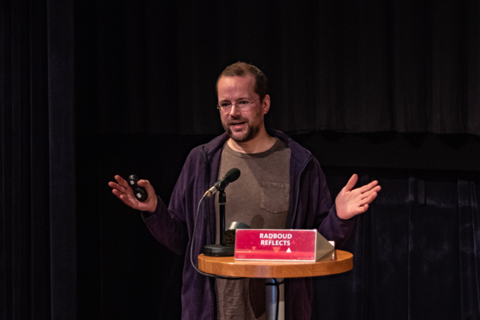
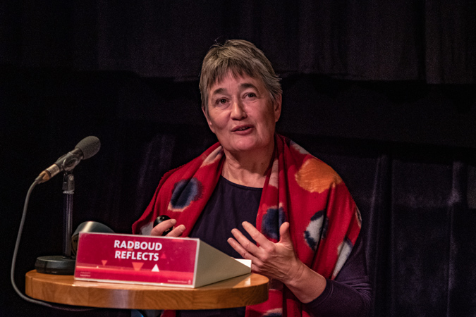
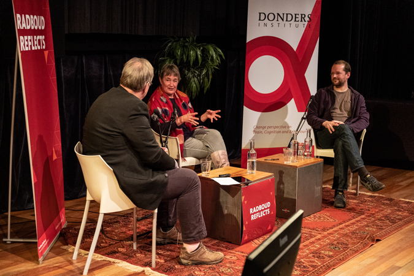

# Review for a Radboud Reflects event

This assignment was completed as part of my Methods and Skills 1 seminar during my Research Master Programme at [Radboud University Nijmegen](https://www.ru.nl/).

You can watch the hole event here:

<iframe width="560" height="315" src="https://www.youtube.com/embed/1JvkcstJ6Bk" title="YouTube video player" frameborder="0" allow="accelerometer; autoplay; clipboard-write; encrypted-media; gyroscope; picture-in-picture" allowfullscreen></iframe>

My task was to write a short review about the event, you can find it [here](https://www.ru.nl/radboudreflects/terugblik/terugblik-2020/terugblik-2020/20-12-09-the-science-relaxation-lectures-by/) and below.

# Science of Relaxation

On 9 December, two experts gave a lecture on _“The Science of Relaxation”_: _Anne Speckens_, a psychiatrist known of her research on mindfulness and mental processes playing a role in the development of depression and anxiety, and _Martin Dresler_, a neuroscientist known for his work on cognitive processes occurring during sleep and their role in different cognitive functions. During the livestream, they discussed the different aspects of our relation to sleep and relaxation.

The topic of the event, organized by _Radboud Reflects_ and _Donders Institute of Radboud University_, could not be more relevant these days. When the world is struggling with the results of a global pandemic affecting our everyday lives, it is no surprise that the value of efficient relaxation radically increases. Modernity brought dramatic changes to our habits and lifestyles, that is no question; and these changes are exaggerated by the results of new kinds of regulations determining our everyday activities. From shopping or working, through travelling, to leisure in general, we are in a constant rush due to the cravings we face while trying to live a fulfilling life. On top of this, everything is changing in an ever-accelerating manner, whereas people have less and less time for relaxation.

## Sleep - what is it good for?

In the first part of the lecture, _Martin Dresler_ presented parts of his research on sleep. He introduced the strangeness of the controversiality of sleep as an activity practiced virtually by every animal. Looking at it from an evolutionary perspective, considering sleep as something beneficial seems rather paradoxical, as during sleep there is a higher risk of being attacked by a predator, without being able to flee or of self-defense. However, besides our general experience, research showed that sleep has quite a few biological functions that are crucial for our cognitive capacities to work properly. These functions include clearing the brain of its waste products produced during waking-time, regulating energy metabolism or hormonal balance of the brain, developing the immunological memory of our body, or regulating memory consolidation and emotions. Furthermore, dreaming, by simulating threatening situations, can contribute to the development of various coping mechanisms, that can be beneficial not just in a biological manner, but also from a social or psychological perspective too.

Taking all these functions into consideration, _Dresler_ moved on to present the scientific methods for measuring sleep. He emphasized the importance of the quality of our sleeping habits by pointing out that the development of several health impairments, such as Alzheimer’s disease, are related to sleeping disorders. Following this thought, the question arises naturally: how could we improve the quality of our sleep? _Dresler_ discussed different methods that are aimed at the improvement of the different biological functions of sleeping. It was shown that beneficial outcomes could be achieved through the enhancement of sleep; however, there could also be unforeseen risks. Therefore, he ended up on a somewhat ethically charged thought: considering the unpredictability of the risks of trying to optimize sleeping, should we do it?

## Mindfulness - a life practice or a practice of life

For the second lecture of the evening, _Anna Speckens_ took the floor to guide us through the vast field of mindfulness research. Having its origins in the Eastern traditional philosophies like Buddhism, the ever-growing interest in Western cultures surrounding the practitioners and scientists engaging in mindfulness is a rather peculiar phenomenon. There is no surprise for this expanding interest, as in Western societies with the fixation on constant economic growth and expansion, complemented with the pressure to be successful and achieve as much as it is possible. People usually are not able to have enough time to process all the information and experiences they are bombarded with. The increased pressure present in our everyday life is one of the main causes of the increasing occurrences of mental disorders as anxiety, depression, stress, distress, or burnout.

_Speckens_ continued with presenting what they are doing to fight the negative effects of our lifestyles, by providing mindfulness training for people that are feeling the urge for change in their life. They teach various techniques, including meditation, to show people how they can be able to learn recognizing their unconscious emotional reactions and behavioral patterns, and by training to build an acceptance without judgement towards these. This is what they call disengagement; by achieving such a state the opportunity to objectively examine the once unconscious patterns, the opportunity arises to intentionally change them. If being successful in practicing and learning mindfulness, the results are better self-care by recognizing the true needs one might have, or by being able to accept unpleasant experiences. Another beneficial result can be a more open-minded attitude towards oneself and others, therefore gaining the ability to be more present in the building of meaningful human relationships.

## Mindfulness and sleep - how are they related?

_Speckens_ presented results of research analyzing the connection between practicing mindfulness and the quality of sleep. In general, it can be said that those practicing mindfulness have better sleep, this can mainly be explained by the overall improvement mindfulness has on symptoms like anxiety and depression. She closed her thoughts by quoting the “four noble truths”, also found in Buddhist teachings, underlying mindfulness training. The main message was to accept suffering as part of life, originating from craving; and by learning to free oneself from craving, we can achieve a life where thinking, acting and meditating lead to a complete liberation from suffering.

In the last section, the two lecturers answered some questions from the online audience, presented by _Cees Leijenhorst_, the host of the event. Most questions considered techniques for sleep enhancement, the role of mindfulness in achieving a fulfilling life, or the undervaluation of sleep in our society. With their preparedness and expertise, the audience were presented by a livid, more personal discussion of the individual aspect of the relationship between sleep and mindfulness.

Dávid Zsámboki
